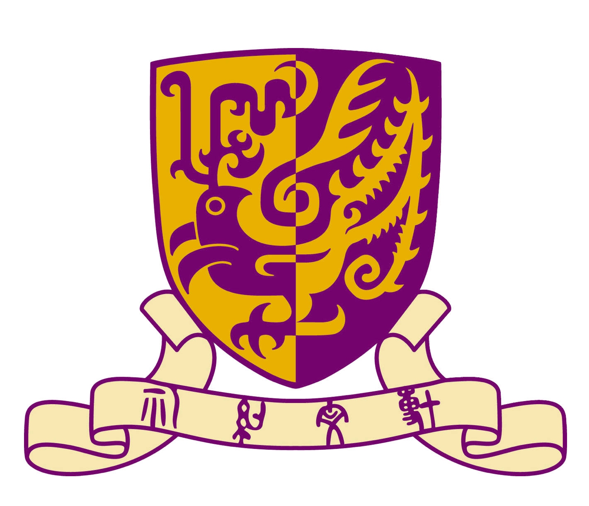
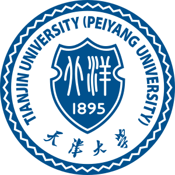

## Biography

I am currently a first year Ph.D. student in the [Chinese University of Hong Kong (CUHK)](https://www.cuhk.edu.hk/english/index.html), supervised by [Prof. Yixuan Yuan](https://www.ee.cuhk.edu.hk/~yxyuan/). 
Also, I was a visiting student in the Medical Artificial Intelligence Laboratory at [Westlake University](https://en.westlake.edu.cn/), supervised by [Prof. Yefeng Zheng (IEEE & AIMBE Fellow)](https://sites.google.com/site/yefengzheng/), in 2025.
Before that, I received my M.Phil. degree under the supervision of [Prof. Lei Zhu](https://sites.google.com/site/indexlzhu/home?authuser=0) and [Prof. Anyi Rao](https://anyirao.com/) at [The Hong Kong University of Science and Technology](https://hkust.edu.hk/), in 2024, and the B.Eng. degree from [School of Precision Instrument and Opto-Electronics Engineering](https://www.tju.edu.cn/info/1044/1251.htm) at [Tianjin University](https://www.tju.edu.cn/), in 2022.

My research interests mainly lie in Low-level Vision, Generative Modeling, and Medical Image Analysis.

Thanks for your reading! Welcome to contact me about research collaboration, please don't hesitate to drop me emails if you are interested in my research.

<!--
## Research Interests

* Video restoration under real-world adverse conditions.
* Efficient neural network for low-level applications (ViTs, Diffusions, Mambas).
* Medical image analysis for clinical application.
-->

## News

* [08/2025]  I start my Ph.D. journey at CUHK.
* [07/2025] Three papers accepted by ACM MM 2025.
* [07/2025] One paper accepted by ACM UIST 2025 with Oral presentation.
* [02/2025] One paper accepted by CVPR 2025.
* [07/2024] I passed my oral defense for the M.Phil. degree.
* [07/2024] One paper accepted by ACM MM 2024 with Oral presentation (3.97%).
* [07/2024] One paper accepted by ECCV 2024.
* [06/2024] One paper accepted by IJCV 2024.
* [02/2024] One paper accepted by CVPR 2024.
* [07/2023] One paper accepted by ACM MM 2023. 
* [07/2023] One paper accepted by ICCV 2023.

## Education Experiences

### [Chinese University of Hong Kong](https://www.cuhk.edu.hk/english/index.html)
Ph.D. in Electronic Engineering, Aug. 2025 to Jul. 2028 (expected) 

### [The Hong Kong University of Science and Technology, Guangzhou](https://www.hkust-gz.edu.cn/)
M.Phil. in Robotics and Autonomous Systems, Sep 2022 ~ Oct 2024.

### [Tianjin University (Peiyang University)](https://www.tju.edu.cn/)
B.Eng. in Measurement & Control Technology and Instruments, Sep 2018 - Jul 2022.

## Internship Experiences

### [Medical Artificial Intelligence Laboratory, Westlake University](https://medai.lab.westlake.edu.cn/)
Advisor: [Prof. Yefeng Zheng](https://sites.google.com/site/yefengzheng/) and [Prof. Hong Wang](https://hongwang01.github.io/)

### [Multimedia Creativity Lab (MMLab), HKUST](https://mmlab-hkust.github.io/)
Advisor: [Prof. Anyi Rao](https://anyirao.com/)

### [VIP Lab, HKUST(GZ)](https://sites.google.com/site/indexlzhu/team)
Advisor: [Prof. Lei Zhu](https://sites.google.com/site/indexlzhu/home?authuser=0) and [Dr. Yijun Yang](https://yijun-yang.github.io/)

## Selected Publications

\* Equal Contribution

### [SAMVSR: Leveraging Semantic Priors to Zone-Focused Mamba for Video Snow Removal](https://hongtao-wu.github.io/)

**Hongtao Wu&#42;**, Yifeng Wu&#42;, Jiaxuan Jiang, Chengyu Wu, Hong Wang, Yefeng Zheng.

Proceedings of the 33rd ACM International Conference on Multimedia (ACM MM), 2025. [[code]](https://hongtao-wu.github.io/)

### [CineVision: An Interactive Pre-visualization Storyboard System for Director–Cinematographer Collaboratio](https://hongtao-wu.github.io/)

Zheng Wei&#42;, **Hongtao Wu&#42;**, Lvmin Zhang, Xian Xu, Yefeng Zheng, Pan Hui, Maneesh Agrawala, Huamin Qu, Anyi Rao 

User Interface Software and Technology (UIST), 2025. (Oral) [[code]](https://github.com/TonyHongtaoWu/CineVision)

<!--
### [SnowMaster: Comprehensive Real-world Image Desnowing via MLLM with Multi-Model Feedback Optimization.](https://openaccess.thecvf.com/content/CVPR2025/html/Lai_SnowMaster_Comprehensive_Real-world_Image_Desnowing_via_MLLM_with_Multi-Model_Feedback_CVPR_2025_paper.html)
  Jianyu Lai, Sixiang Chen, Yunlong Lin, Tian Ye, Yun Liu, Song Fei, Zhaohu Xing, **Hongtao Wu**, Weiming Wang, and Lei Zhu.

  Proceedings of the IEEE/CVF Conference on Computer Vision and Pattern Recognition (CVPR), 2025.

-->

### [RainMamba: Enhanced Locality Learning with State Space Models for Video Deraining.](https://arxiv.org/abs/2407.21773)
  **Hongtao Wu**, Yijun Yang, Huihui Xu, Weiming Wang, Jinni Zhou, and Lei Zhu.

  Proceedings of the 32nd ACM International Conference on Multimedia (ACM MM), 2024. **(Oral)** [[code]](https://github.com/TonyHongtaoWu/RainMamba)

### [Semi-Supervised Video Desnowing Network via Temporal Decoupling Experts and Distribution-Driven Contrastive Regularization.](https://link.springer.com/chapter/10.1007/978-3-031-72684-2_5)
  **Hongtao Wu**, Yijun Yang, Angelica Aviles-Rivero, Jingjing Ren, Sixiang Chen, Haoyu Chen, Lei Zhu.
  
  European Conference on Computer Vision (ECCV), 2024. [[code]](https://github.com/TonyHongtaoWu/SemiVDN)

<!--
### [Triplane-Smoothed Video Dehazing with CLIP-Enhanced Generalization.](https://link.springer.com/article/10.1007/s11263-024-02161-0)
  Jingjing Ren, Tian Ye, Haoyu Chen, **Hongtao Wu**, Lei Zhu. 

  International Journal of Computer Vision (IJCV), 2024.

### [Genuine Knowledge from Practice: Diffusion Test-Time Adaptation for Video Adverse Weather Removal.](https://openaccess.thecvf.com/content/CVPR2024/html/Yang_Genuine_Knowledge_from_Practice_Diffusion_Test-Time_Adaptation_for_Video_Adverse_CVPR_2024_paper.html)
  Yijun Yang, **Hongtao Wu**, Angelica I. Aviles-Rivero, Yulun Zhang, Jing Qin, Lei Zhu.
  
  Proceedings of the IEEE/CVF Conference on Computer Vision and Pattern Recognition (CVPR), 2024.

-->

### [Mask-Guided Progressive Network for Joint Raindrop and Rain Streak Removal in Videos.](https://dl.acm.org/doi/10.1145/3581783.3612001)
  **Hongtao Wu**, Yijun Yang, Haoyu Chen, Jingjing Ren, Lei Zhu. 
  
  Proceedings of the 31st ACM International Conference on Multimedia (ACM MM), 2023. [[code]](https://github.com/TonyHongtaoWu/ViMP-Net)
  
<!--
### [Snow Removal in Video: A New Dataset and A Novel Method.](https://openaccess.thecvf.com/content/ICCV2023/html/Chen_Snow_Removal_in_Video_A_New_Dataset_and_A_Novel_ICCV_2023_paper.html)
  Haoyu Chen, Jingjing Ren, Jinjin Gu, **Hongtao Wu**, Xuequan Lu, Haoming Cai, Lei Zhu.
  
  IEEE/CVF International Conference on Computer Vision (ICCV), 2023.

###  2 **_CVPR_**  &nbsp;&nbsp;&nbsp;  1 **_ICCV_**  &nbsp;&nbsp;&nbsp;  1 **_ECCV_**  &nbsp;&nbsp;&nbsp;  1 **_IJCV_**  &nbsp;&nbsp;&nbsp;  2 **_ACM MM_** 
-->

## Awards

* PG Scholarship of CUHK, 2025-2028
* PG Scholarship of HKUST(GZ), 2022-2024
* Oral Presentation (3.97%) in ACM International Conference on Multimedia (ACM MM), 2024
* First-Class Scholarship of Tianjin University, 2022
* Excellent Conclusion of National College Students’ Innovation and Entrepreneurship Training Program, 2021
* Outstanding graduate of Zhenhai High School of Zhejiang, 2018

## Professional Activities

Conference Reviewer: CVPR, ICCV, ECCV, ACM MM, AAAI, MICCAI.

Journal Reviewer: TMI

## Acknowledgements

I remain deeply indebted to the intellectual generosity of mentors and colleagues who shaped my academic journey. To all kindred spirits I meet along the way—may our pursuits ignite not just minds, but souls, and may we find meaning in both questions and answers.
